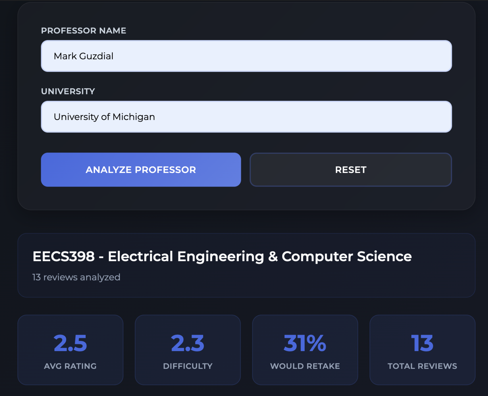

# ProfRater

ProfRater analyzes RateMyProfessor reviews using AI to give you quick insights about professors without scrolling through hundreds of student comments.



## What it does

You enter a professor's name and their university. The app scrapes all their RateMyProfessor reviews and uses Claude AI to generate a comprehensive summary of their teaching style, difficulty level, and what students actually think about them.

## How it works

The backend uses Stagehand (an AI-powered browser automation library) to navigate RateMyProfessor and extract review data. It grabs ratings, difficulty scores, course names, review comments, and student tags. All of this gets sent to Claude AI which analyzes the data and produces a readable summary.

The scraper builds a direct search URL instead of clicking through dropdowns, which makes it more reliable across different professor pages. It also handles missing data gracefully since not all professors have complete information available.

## Tech stack

**Frontend**: Plain HTML, CSS, and JavaScript. No framework needed for the simple form interface.

**Backend**: Express server written in TypeScript. The scraper module uses Stagehand for web automation and Zod for schema validation. The analyzer module sends the scraped data to Claude for processing.

**Infrastructure**: Deployed on Vercel as serverless functions. Uses Browserbase for cloud browser instances (required for Stagehand). Environment variables store API keys for Anthropic, OpenAI (needed by Stagehand), and Browserbase credentials.

## Running locally

Clone the repo and install backend dependencies:

```
cd backend
npm install
```

Create a `.env` file in the backend directory with your API keys:

```
ANTHROPIC_API_KEY=your_key_here
OPENAI_API_KEY=your_key_here
BROWSERBASE_API_KEY=your_key_here
BROWSERBASE_PROJECT_ID=your_project_id_here
```

Start the backend server:

```
npm run dev
```

Open `frontend/dist/index.html` in your browser. The frontend is already built, just a static HTML file that makes requests to localhost:3001.

## Deployment

The app deploys to Vercel automatically when you push to the main branch. You need to set the same environment variables in your Vercel project settings.

Note that Vercel's free tier has a 10 second timeout for serverless functions. Scraping and analyzing can take longer than that depending on how many reviews a professor has. You might need Vercel Pro for the 60 second timeout limit.

## Known limitations

Browserbase credits run out quickly during testing since each scrape session costs minutes. The scraper loads about 60 reviews per professor (clicks "Load More" three times). RateMyProfessor's layout can change, which would break the scraper until the extraction prompts get updated.

The app doesn't cache results, so repeated queries for the same professor use up more API credits than necessary. Adding a database layer would help but increases complexity.
